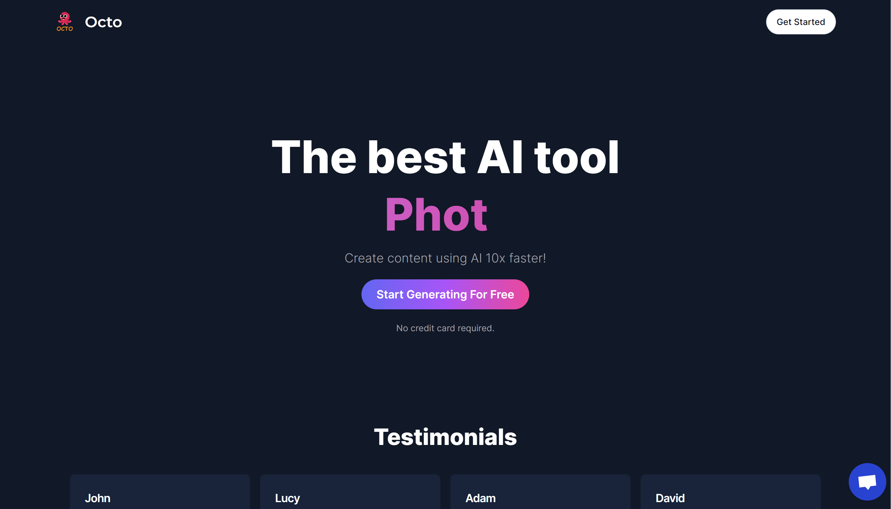

# AI SAAS Web Application

A full stack AI SAAS Platform built on Next JS 13. This Saas application uses the Open AI's GPT API's to produce results for the prompts given to the application.

## Screenshots

<!--  -->

## Tech Stack

- Next JS 13

- Tailwind CSS (Shadcn UI)

- Prisma

- MySQL

- Stripe

- Crisp

## Features

- Tailwind design
- Tailwind animations and effects
- Full responsiveness
- Clerk Authentication (Email, Google login and signup)
- Image Generation Tool (Open AI)
- Video Generation Tool (Replicate AI)
- Conversation Generation Tool (Open AI)
- Music Generation Tool (Replicate AI)
- Stripe monthly subscription
- Free tier with API limiting

## Authors

- [@Aman-Gupta-404](https://github.com/Aman-Gupta-404/google_docs_clone)

## Demo

https://octo-ai-three.vercel.app/
